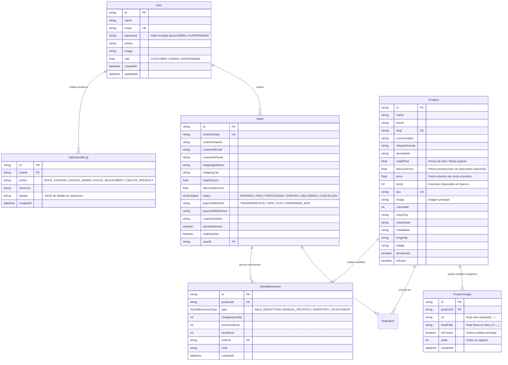

# 🏛️ ARQUITECTURA DE DATOS REALES, SEGURIDAD & PERMISOS
## AURA MAISON DE PARFUM — ECOSISTEMA CLIENTE / ADMINISTRADOR

Este documento especifica la arquitectura final con **cero datos hardcodeados**, persistencia 100% en **PostgreSQL local**, autenticación diferenciada para Clientes (Gmail/Google) y Administradores (credenciales clásicas hasheadas), almacenamiento local de imágenes en disco y roles de autorización jerárquicos (**SUPERADMIN**, **ADMIN**, **CUSTOMER**).

---

## 🗄️ 1. Modelo Relacional de Base de Datos (PostgreSQL)

---

## 🔐 2. Matriz de Permisos y Roles

| Funcionalidad / Módulo | CLIENTE (`CUSTOMER`) | ADMINISTRADOR (`ADMIN`) | SUPERADMINISTRADOR (`SUPERADMIN`) |
|---|:---:|:---:|:---:|
| **Navegar Catálogo y Ficha Olfativa** | ✅ | ✅ | ✅ |
| **Generar Pedido Web y Descuento Stock** | ✅ | ✅ | ✅ |
| **Login con Gmail / Google** | ✅ (Directo) | ❌ | ❌ |
| **Login Clásico (Email + Password Hasheado)** | ❌ | ✅ | ✅ |
| **Acceso a `ecom - administrador` (Puerto 3001)** | ❌ (Bloqueado) | ✅ | ✅ |
| **Crear y Editar Productos** | ❌ | ✅ | ✅ |
| **Asignar Precio Retail y Precio Descuento** | ❌ | ✅ | ✅ |
| **Subir Múltiples Imágenes (Disco C:)** | ❌ | ✅ | ✅ |
| **Generar Pedidos Manuales (Venta Asistida WhatsApp)** | ❌ | ✅ | ✅ |
| **Ajustar Stock Rápido (+1 / -1 / +10)** | ❌ | ✅ | ✅ |
| **Exportar Pedido a ERP / SUNAT (UBL 2.1)** | ❌ | ✅ | ✅ |
| **Ver Kardex de Movimientos** | ❌ | ✅ | ✅ |
| **Ver Lista de Usuarios y Clientes** | ❌ | ✅ (Solo lectura) | ✅ (Completo) |
| **Cambiar Roles de Usuarios** | ❌ | ❌ (Denegado) | ✅ (Exclusivo) |
| **Crear / Eliminar otros Administradores** | ❌ | ❌ (Denegado) | ✅ (Exclusivo) |
| **Ver Logs de Auditoría del Sistema** | ❌ | ❌ (Denegado) | ✅ (Exclusivo) |

---

## 🔑 3. Cuentas Administrativas Iniciales en Base de Datos Real

Los clientes NO están precargados ni expuestos. Sus cuentas se generan de forma privada y segura cuando cada cliente real inicia sesión en la tienda con su cuenta de Google / Gmail.

Únicamente existen en el sistema las cuentas del personal administrativo para la gestión del Atelier:

| Rol | Personal | Correo Administrativo | Método de Autenticación |
|---|---|---|---|
| **SUPERADMIN** | Jean-Luc de Montmirail | `superadmin@auraparfums.com` | Login Clásico (Email + Contraseña Bcrypt) |
| **ADMIN** | Alexandre de Mortemart | `admin@auraparfums.com` | Login Clásico (Email + Contraseña Bcrypt) |

---

## 🖼️ 4. Gestión de Imágenes Locales y Múltiples (Almacenamiento en C:)

1. **Ruta Física en Disco:** `c:\Users\DAVID\.gemini\antigravity-ide\ecom\public\uploads` y `C:\ecom-storage\uploads`.
2. **Ruta de Acceso Web:** `/uploads/[timestamp]-[hash]-[filename]`.
3. **Múltiples Imágenes:** Cada producto puede tener $N$ imágenes vinculadas en la tabla `ProductImage`. Una de ellas se designa como principal (`isPrimary = true`).
4. **Formulario de Producto:**
   - Permite arrastrar o seleccionar múltiples archivos JPG, PNG, WEBP.
   - Sube las imágenes vía API `POST /api/upload` (multipart/form-data).
   - Guarda el archivo binario en el disco local y crea el registro correspondiente en PostgreSQL.
   - Muestra miniaturas en la ficha de producto de la tienda y en la tabla del panel de administración.

---

## 🏷️ 5. Lógica de Precios (Retail vs Descuento)

- **`retailPrice`**: Precio original o de catálogo de la fragancia (e.g. $420.00).
- **`discountPrice`**: Precio en promoción especial (e.g. $360.00). Si es nulo o 0, el perfume se vende a su precio retail.
- **`price`**: Precio efectivo de venta cobrado en el checkout. Se calcula como:
  $$\text{price} = \begin{cases} \text{discountPrice} & \text{si discountPrice } > 0 \land \text{discountPrice } < \text{retailPrice} \\ \text{retailPrice} & \text{en otro caso} \end{cases}$$
- En la interfaz del cliente: Se muestra el precio retail tachado con el porcentaje de ahorro (e.g. `-$60 / -14%`) y el precio final resaltado en dorado.

---

## 🚀 6. Plan de Ejecución Inmediato

1. **Actualizar Prisma Schema**: Añadir campos a `User`, `Product`, modelo `ProductImage`, modelo `AdminAuditLog`.
2. **Migrar PostgreSQL**: Ejecutar `npx prisma db push` para crear las nuevas tablas y columnas en la base de datos real.
3. **Poblar Usuarios y Productos con Datos Reales**: Ejecutar script con contraseñas hasheadas en `bcrypt` y catálogo enriquecido con precios retail y descuento.
4. **Implementar Endpoint `/api/upload`**: Para subida física y almacenamiento de imágenes en disco.
5. **Implementar Login Normal para Administradores**: En `ecom - administrador`, pantalla `/login` y verificación de sesión con permisos.
6. **Implementar Login Gmail Real para Clientes**: En `ecom`, autenticación directa contra PostgreSQL con email Gmail y vinculación de pedidos.
7. **Actualizar Formulario de Productos y Galería**: En `ecom - administrador` y vista en `ecom`.
8. **Validación Integral**: Pruebas de subida, login de clientes, login de superadmin y compra con descuento de stock.
