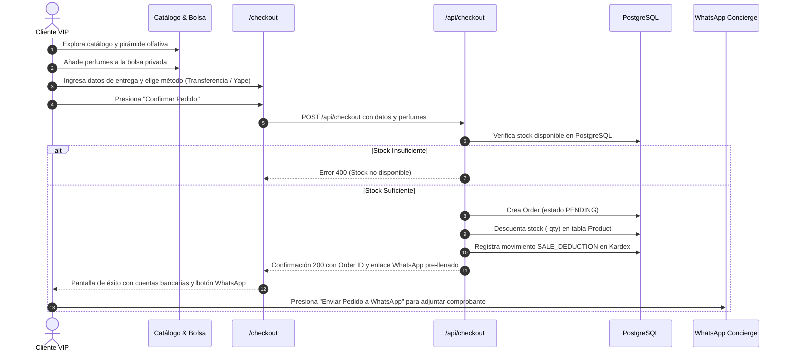
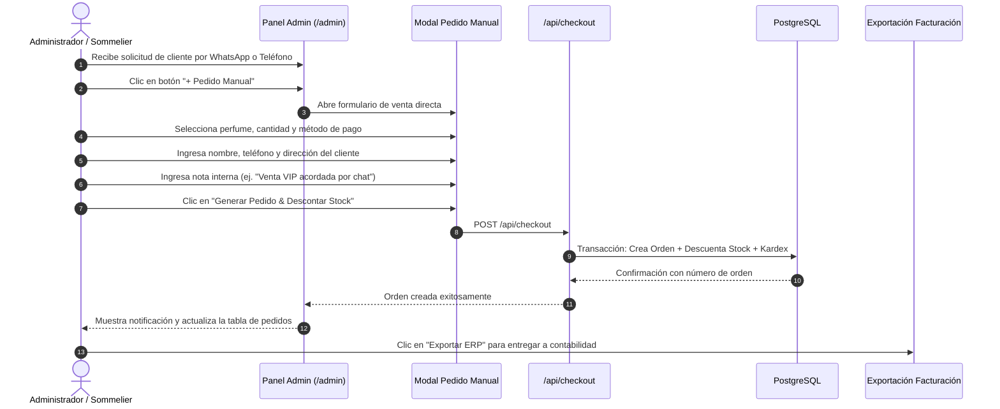
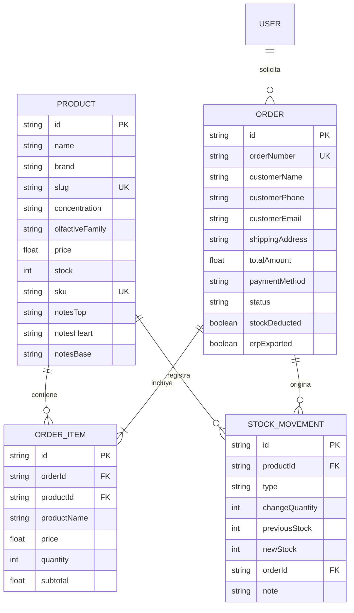

# 🏛️ AURA MAISON DE PARFUM — ARQUITECTURA DEL SISTEMA Y PROCESOS OPERATIVOS

Documentación técnica y funcional sobre la **Estructura del Sistema**, los **Procesos Operativos de Venta** y la **Plataforma de Administración**, detallando el porqué y el cómo de la **generación de pedidos por parte del Administrador** junto al **descuento automático de inventario** en PostgreSQL.

---

## 📐 1. Estructura General del Sistema

El sistema está concebido bajo una arquitectura moderna desacoplada en tres niveles principales: **Presentación de Lujo (Frontend)**, **Lógica de Negocio y Transacciones (API & Services)** y **Persistencia Relacional (PostgreSQL + Prisma)**.

```
                           +-------------------------------------------------+
                           |           AURA MAISON DE PARFUM                 |
                           +-------------------------------------------------+
                                      |                           |
                  +-------------------+                           +-------------------+
                  |                                                                   |
                  v                                                                   v
     [ CLIENTE VIP (Web) ]                                           [ ADMINISTRADOR (Atelier) ]
     • Catálogo de Perfumería                                        • Panel de Control (/admin)
     • Ficha & Pirámide Olfativa                                     • Generación de Pedidos Manuales
     • Bolsa Privada de Compras                                      • Registro y Edición de Perfumes
     • Checkout Directo                                              • Ajuste Rápido de Stock (+1/-1/+5)
     • Botón WhatsApp Concierge                                      • Auditoría Kardex y Exportación ERP
                  |                                                                   |
                  +-------------------+                           +-------------------+
                                      |                           |
                                      v                           v
                  +-------------------------------------------------------------------+
                  |             CAPA DE API & CONTROLADORES (Next.js 16)             |
                  |  • /api/products          • /api/checkout                         |
                  |  • /api/orders            • /api/orders/[id]/export-erp           |
                  |  • /api/stock-audits      • /api/products/[id]/stock              |
                  +-------------------------------------------------------------------+
                                                      |
                                                      v
                  +-------------------------------------------------------------------+
                  |            MOTOR DE TRANSACCIONES & SERVICIOS (Prisma)            |
                  |  • Validación de Existencias de Frascos                           |
                  |  • Descuento Atómico de Stock (newStock = prevStock - qty)        |
                  |  • Asentamiento de Orden y Registro de Kardex (StockMovement)     |
                  +-------------------------------------------------------------------+
                                      |                           |
                  +-------------------+                           +-------------------+
                  |                                                                   |
                  v                                                                   v
     [ BASE DE DATOS POSTGRESQL ]                                     [ INTEGRACIONES EXTERNAS ]
     • Tablas: Product, Order, OrderItem,                              • WhatsApp API (Atención VIP)
       StockMovement, User                                            • Sistema de Facturación Externa
     • Puerto: localhost:5432                                           (Payload UBL 2.1 JSON para ERP)
     • Base: aura_parfums
```

---

## 👑 2. ¿Por qué el Administrador también puede generar pedidos?

En el modelo de negocio de la **Alta Perfumería de Nicho** ($300 - $500 USD por frasco), la venta directa por la web no es el único canal ni el más frecuente. Habilitar la creación manual de pedidos desde el panel de control resuelve necesidades operativas críticas:

### 2.1. Venta Asistida por WhatsApp (Social Selling & Concierge)
- Muchos clientes de alta gama prefieren consultar directamente con el sommelier privado por WhatsApp antes de decidir entre un aroma oriental, amaderado o floral.
- Una vez acordada la compra por chat, el administrador no obliga al cliente a registrarse en la web: **el administrador ingresa al panel, crea el pedido manual con los datos acordados y descuenta el stock en un solo clic**.

### 2.2. Ventas en Showroom, Boutique Privada o Eventos Exclusivos
- En presentaciones de colecciones privadas o ventas en atelier físico, los frascos se entregan en mano.
- Registrar la venta directamente en el panel administrativo asegura que **el inventario de la tienda online se descuente al instante**, evitando que un usuario web compre un frasco que acaba de ser vendido físicamente.

### 2.3. Pedidos Corporativos y Regalos Institucionales
- Empresas o clientes VIP que solicitan 5 o 10 frascos personalizados o con notas dedicatorias.
- El administrador genera el pedido formal, registra el método de pago acordado (Transferencia bancaria o factura diferida) y deja asentado el pedido con sus notas internas.

### 2.4. Garantía de Trazabilidad Total
- Si el administrador descontara el stock "a mano" sin generar una orden, se perdería el rastro de a quién se le vendió y a qué precio.
- Al generar un **Pedido Manual**, el sistema crea la orden oficial, emite el número correlativo (`AUR-2026-XXXX`), descuenta las unidades en PostgreSQL y genera el payload listo para el sistema de facturación externo.

---

## 🔄 3. Procesos Operativos del Sistema

A continuación se detallan los 6 procesos que rigen el funcionamiento del e-commerce:

### 🛒 Proceso 1: Compra Directa del Cliente (Web Self-Service)



---

### 💼 Proceso 2: Generación Manual de Pedidos por el Administrador (Venta Asistida)



---

### 📦 Proceso 3: Descuento Atómico de Stock y Kardex de Auditoría

Cada vez que se produce una salida o entrada de inventario, el sistema ejecuta la siguiente lógica estricta:

1. **Validación previa**:
   $$\text{Stock Disponible} \ge \text{Cantidad Solicitada}$$
2. **Actualización atómica en PostgreSQL**:
   $$\text{Nuevo Stock} = \text{Stock Anterior} - \text{Cantidad}$$
3. **Registro inmutable en `StockMovement`**:
   - `productId`: ID del perfume afectado.
   - `type`: `SALE_DEDUCTION` (Venta) o `MANUAL_RESTOCK` (Ingreso).
   - `changeQuantity`: Número negativo en ventas (ej. `-2`), positivo en reposiciones (ej. `+10`).
   - `previousStock`: Existencia antes del movimiento.
   - `newStock`: Existencia resultante tras el movimiento.
   - `orderId`: Número de orden vinculado.
   - `note`: Detalle descriptivo del movimiento.

---

### 📲 Proceso 4: Coordinación y Cierre de Pago vía WhatsApp

Para evitar pasarelas con cobro de comisiones y tarjetas rechazadas:

1. El cliente o el administrador generan la orden.
2. La plataforma genera un enlace dinámico hacia la API de WhatsApp (`https://wa.me/51987654321?text=...`) con el siguiente formato pre-llenado:
   ```text
   *SOLICITUD DE PEDIDO - AURA MAISON DE PARFUM* 👑

   Hola, deseo confirmar y coordinar el pago de mi pedido recién generado:

   📋 *N° de Pedido:* AUR-2026-9379
   👤 *Cliente:* Carlos Mendoza
   📍 *Despacho:* Calle Las Begonias 441, San Isidro, Lima
   💳 *Método de Pago Elegido:* Transferencia Bancaria
   💰 *Monto Total:* $880.00 USD

   ✨ *Creaciones Solicitadas:*
   • *2x* Édition Impériale Paris - Cuir Impérial Extrait ($440.00)

   Quedo atento(a) a la confirmación de recepción y número de comprobante para el despacho privado. ¡Muchas gracias!
   ```
3. El cliente adjunta la captura del comprobante de transferencia o Yape.
4. El equipo de atención verifica la acreditación en la cuenta bancaria y programa el envío.

---

### 🧾 Proceso 5: Desacoplamiento y Entrega de Datos para Facturación Externa

Siguiendo el requerimiento de **no realizar la facturación interna en la tienda**, el sistema actúa como el originador comercial y entrega los datos al sistema tributario o ERP:

1. El pedido queda registrado con estado `PENDING` o `PAID`.
2. El administrador o el sistema contable llama a:
   `POST /api/orders/[id]/export-erp`
3. El sistema responde con el payload estandarizado en formato UBL 2.1:
   ```json
   {
     "invoicingVersion": "2.1-UBL-SUNAT",
     "originSystem": "AURA_ECOMMERCE_NEXTJS",
     "externalReferenceId": "AUR-2026-9379",
     "systemOrderId": "ord_1790642819",
     "transactionDate": "2026-09-29T04:22:00.000Z",
     "customer": {
       "fullName": "Carlos Mendoza",
       "email": "carlos.mendoza@vip.com",
       "phone": "+51 912 345 678",
       "deliveryAddress": "Calle Las Begonias 441",
       "city": "Lima",
       "taxId": "CONSUMIDOR_FINAL_O_RUC"
     },
     "paymentDetails": {
       "method": "TRANSFERENCIA",
       "currency": "USD",
       "status": "PAID"
     },
     "financials": {
       "subtotalNet": 745.76,
       "igvTax": 134.24,
       "totalAmount": 880.00
     },
     "items": [
       {
         "description": "Édition Impériale Paris - Cuir Impérial Extrait",
         "unitPrice": 440.00,
         "quantity": 2,
         "lineTotal": 880.00
       }
     ],
     "stockStatus": "STOCK_ALREADY_DEDUCTED_BY_ECOMMERCE"
   }
   ```
4. La orden se marca con la bandera `erpExported: true` para evitar duplicidad de emisión contable.

---

### ⚙️ Proceso 6: Gestión de Catálogo y Calibración Rápida de Inventario

Desde el panel de administración (`/admin` -> Pestaña 1):
1. **Creación de Perfume**:
   - Registro de Nombre, Marca, Concentración (Extrait 35%), Familia Olfativa, Precio, Stock Inicial y Pirámide Olfativa (Salida, Corazón, Fondo).
   - El stock inicial genera automáticamente un movimiento `MANUAL_RESTOCK` en el Kardex.
2. **Ajuste Rápido (+1 / -1 / +5)**:
   - Botones directos en la tabla para calibrar mermas, muestras de cortesía o ingresos de nuevos lotes sin tener que abrir el formulario de edición.
   - Cada clic impacta inmediatamente en PostgreSQL mediante `/api/products/[id]/stock`.

---

## 🗄️ 4. Esquema de Entidades en PostgreSQL



---

## 🖥️ 5. Resumen de Rutas y Accesos

| Ruta | Descripción | Perfil |
|---|---|---|
| `/` | Tienda Principal, Colección y Ficha Olfativa | Público / Cliente VIP |
| `/checkout` | Selección de método (Transferencia, Yape, WhatsApp) y confirmación | Cliente |
| `/checkout/success` | Recibo del pedido, cuentas bancarias y botón WhatsApp con datos pre-llenados | Cliente |
| `/admin` | Panel de Control: Pedidos manuales, catálogo, Kardex y configuración PostgreSQL | Administrador |
